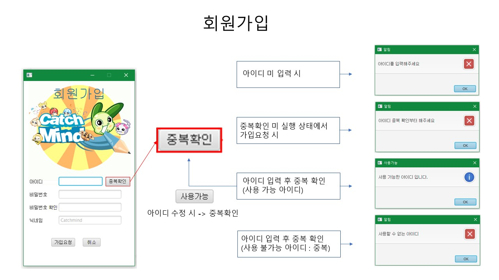
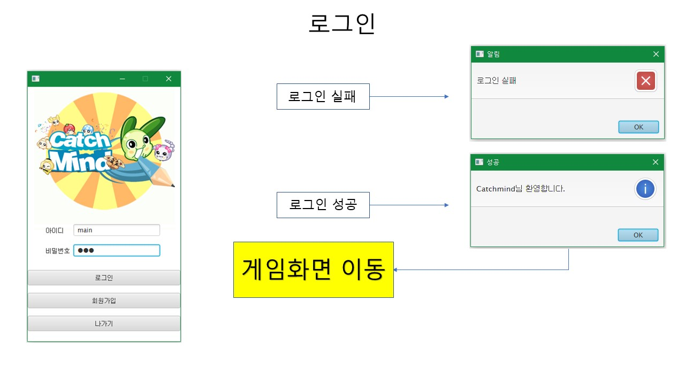
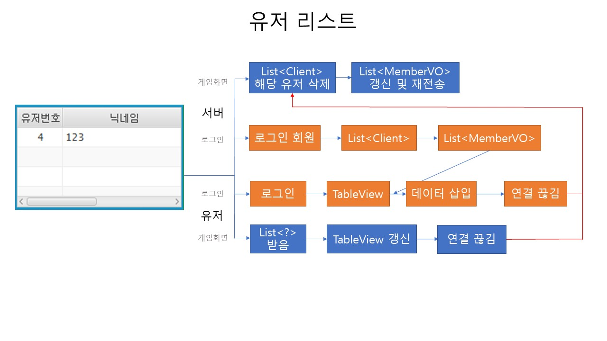
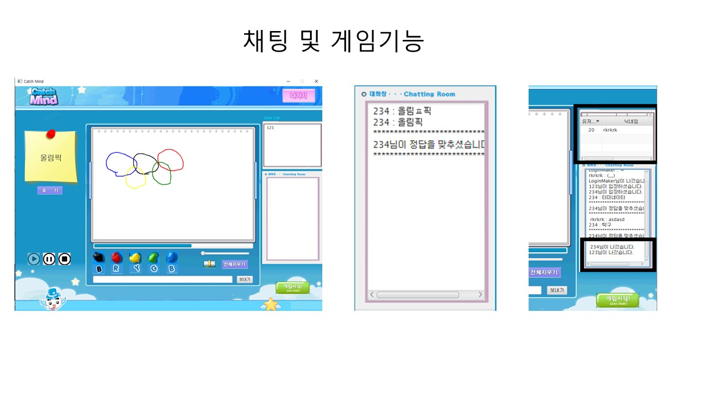

# Catchmind copy
캐치마인드 게임 기능 구현

## 프로젝트 개요
- javafx를 활용하여 캐치마인드의 핵심기능을 구현  
- 제작 인원 : 4명  
- 제작 기간 : 2021-11-25 ~ 2021-12-06 (약 2주)
- 사용 기술 : Java 8, JavaFX, MySQL Database, Eclipse IDE,   
- 주요 기능 : 로그인, 회원가입 ,채팅, 그림그리기, 게임 등 
- 제작 목적 : 학습 내용을 프로젝트에 직접 적용 해봄으로써 학습 이해도를 높이고 팀원간의 협업 능력을 배양하기 위함

## 주요기능

 

 

 

 

## [시연영상](https://www.youtube.com/watch?v=IanBWw_WaUw) <- youtube link

  
## 팀원 [팀페이지(노션)](https://horse-trail-213.notion.site/322d2103b00c4956b286781958bffaf7)
- [백인광](https://github.com/baek4070/TeamProjectCatchmind) (조장) : 프로젝트 전반 관리 및 기능구현
- [김재관](https://github.com/1KimjaeGwan/TeamProjectCatchmind) : 게임 기능 구현(화면위주)
- [김회진](https://github.com/930521/TeamProjectCatchmind) : 채팅기능 및 참가자 리스트 기능 구현
- [박종혁](https://github.com/gitgw016/TeamProjectCatchmind) : 회원관리 기능 구현

## 어려웠던점
- 각종 초기 개발 환경 세팅(Jar 빌드 패스, 서버 환경, javafx 모듈 설치 등등..)
- 어떤 class를 어떻게, 어떤 구조로 패키징 하고 설계할것인가?
- 체계적인 협업 진행의 어려움
- 기능 구현이 우선되다 보니 코드가 난잡하여 가독성이 떨어짐
- 화면 공유 기능 구현
- 유저 리스트 기능 구현
- 코드를 통합하는 과정에서 발생하는 각종 오류

## 아쉬운점
- 게임 대기방 화면
- 개인 프로필 화면
- 게임내 에서 프로필 수정 기능
- 문제를 맞춘사람이 그림을 그리는 기능
- 순차적 랜덤으로 그림을 그리는 기능
- 아이디 찾기, 비밀번호 찾기 기능
- 게임 결과창 화면
